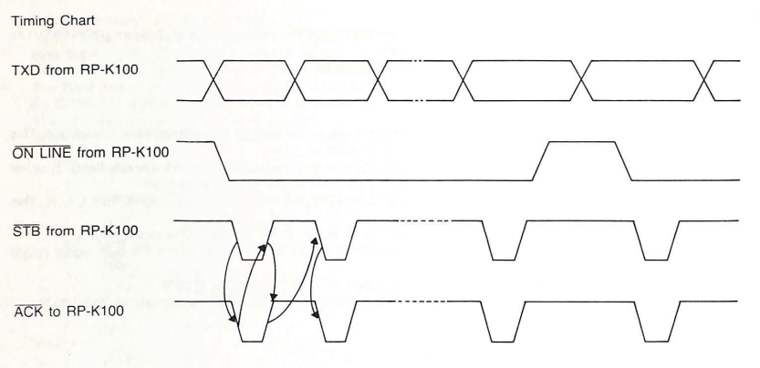

# Reverse engineering the Panasonic Thermalwriter Computer Interface

I have a Panasonic Thermalwriter 12 (model RK-H500) that I bought years ago at a yard sale. It has an intriguing male DE-9 connector on the side and I understand that it can be used as a printer, but I lack the interface box needed to make it work. So I decided to try to reverse engineer it.

This documents my progress so that hopefully someone can pick up where I left off. I believe that other Panasonic typewriters from the same era use the same interface. I've discovered a lot, but I still don't have something working. Hopefully someone out there will have the missing piece of the puzzle.

## Hardware notes
The 9 pin d-sub connector on the left of the typewriter resembles an Atari joystick port. There are no screw terminals, and a standard DE-9 connector with tabs for screw terminals won't fit unless you bend / remove the screw plate on the right of the connector.

")

With the typewriter on and in external mode, I measured pin voltages. Here's what I got:

| Pin |   Voltage
|-----|----------
| 1   | +5 V
| 2   | +5 V
| 3   | +0.21 V
| 4   | +5 V
| 5   | 0
| 6   | 0
| 7   | 0
| 8   | 0
| 9   | 0

I took apart the typewriter and photographed the PCB from both sides. 


Here are some chips on the board, in no particular order

```
D23C255EC ROM
M5M5117P SRAM
74HC02 Quad NOR
74HC374 Octal D flip-flop (near Port)
74LS145 BCD decoder (drives one of 10 outputs) (near Port)
74HC138 3 to 8 line decoder/demux
HD6303XP 1MHZ mcu built in serial 
M54970P 9 bit serial input / latched driver
M54539P Transistor array
```

None of the chips near the port appear to be RS-232 chips or anything like that. The M54970P is on that side of the board, but given its high power output I suspect it's being used to drive the print head (the datasheet's first suggested application is "thermal print head dot driver").

Thinking we might be using the microcontroller's built-in serial protocol, I ran some continuity tests for the microcontroller pins. Here are the connections I found:

- Pin 1 is connected to uC pin 27 (P_62)
- Pin 2 is connected to uC pin 26 (P_61)
- Pin 4 is connected to uC pin 25 (P_60)

I didn't bother to trace the actual PCB, so if something didn't buzz out directly it's not listed here. None of these pins corresponds with the HD6303XP microcontroller's built-in serial peripheral; they're just GPIO pins. It looks like none of the mare interrupt triggering pins either. So I hypothesize that whatever the protocol is, it's probably not very timing sensitive.

### Caution: pitfalls of disassembly
If you have one of these typewriters, I don't recommend taking it apart. They're very cleanly designed and serviceable inside, but flat-flex keyboard ribbon cables are made with adhesive that has started to degrade. This is most problematic for the yellow rigid plastic tabs attached to the back of the business end of the connectors. Without these tabs, it becomes impossible to cleanly push the ribbon cable into the friction fit connector without the thin plastic bending up on the corner and making a bad contact.

#### To reattach ribbon cable tabs
I tried using super glue and it didn't work. Here's what worked great - hot glue and a clothes iron:

1. Heat up your hot glue gun
2. Align the tab so that it's against the non-conductor side of the cable and one flat end is flush wit the bottom
3. Hold it in place on one side while peeling it up on the other and injecting some hot glue.
4. Push down. Don't worry about getting it completely flat or spreading the glue.
5. Put some printer paper or newspaper on both sides of the glued connection
6. Use a clothes iron to smooth out the cable, being careful not to provide lateral pressure that will slide the ribbon connector around
7. Before it cools touch up the position a bit if needed.
8. When cooled trim off any hot glue that oozed out.

You'll then have a perfectly reattached plastic tab. But it's better to not have to do this in the first place


## A research breakthrough
While poking around, I found the complete [service manual](kxw50th.pdf) for a different thermal typewriter - the Panasonic KX-W50TH. The manual is pretty amazing in terms of care and detail. In the full schematic of the typewriter, we see this portion showing the interface:


Of course this is a different typewriter, but the pin assignments are consistent with the voltages and continuity measurements I took earlier. For example, this explains the weird .2 V potential on pin 3, since that pin is an open-collector output and is expected to be pulled up by the interface adapter. 

We also get a simple timing diagram and description of the interface:

> Process:
> (1) The RP-K100 changes the ON LINE signal from H to L indicating that data transmission has started. This ON LINE signal remains Low during the transmission of 1 byte.
> (2) Th e RP-K100 first sends the LSB (D0) of a transmitted byte to the TXD line and changes the STB signal from H to L. This STB signal is sent to P51 of the CPU which is the interruption.
> (3) In the interruption state, the CPU receives a TXD signal and changes the ACK signal from L to H. This ACK signal is sent to the RP-K100.
> (4) After the RP-K100 has received the ACK signal (L level), the STB signal changes from L to H.
> (5) When the STB signal (High) is sent from the RP-K100, the thermalwriter sends the ACK signal (High)
to the RP-K100.
> (6) When the ACK signal is High, the RP-K100 starts to send the next bit of data.
> (7) Once the RP-K100 sends 1 byte of data (8 bits) to the CPU, the ON LINE signal changes from L to H.



The only mystery here is the actual signal timing. The "timing diagram" provides no actual guidelines for signal timing, so we'll have to guess. [This hobbyist](https://retrocomputing.stackexchange.com/questions/13385/panasonic-kx-w50th-data-transfer/13510) who used the actual RP-K105 adapter had to set their print server to "super slow" - whatever that means. I judge that's probably a few hundred bytes per second at most, but could be much lower. Above that their typewriter would print but drop characters.  This protocol hopefully isn't very timing-sensitive because the sender waits for an ACK for each bit sent. 

Unfortunately I don't have the manual for my typewriter, so I'm only assuming that the interface box is the same based on the pin voltages making sense. I know that Panasonic sold the RP-K100 and RP-K105 interface boxes for several different typewriter models, which seems sensible from a business perspective.

## Prototyping an interface
The next step was to prototype an interface board based on the hypothesis that the pinout and interface is as described in the KX-W50TH service manual. For the physical connection, I used a standard DE-9 female solder cup connector and bent the right hand side's metal plate so it would fit.

I chose to use an [RP2040-Zero](https://www.waveshare.com/wiki/RP2040-Zero) board I had lying around, but pretty much any microcontroller with 4 GPIO pins will work. If you try this with a 5v part, you don't even need anything additional. Since the RP2040 is a 3.3v and this bus is pulled to 5v by the typewriter when idle, I used a [74LS240](https://www.futurlec.com/74LS/74LS240.shtml) to drive the ONLINE, STB, and TXD lines.  ACK is simply pulled up to 3.34 with a resistor.  Here's a photo of my lo-fi breadboard layout:


Here's a shot of the assembled breadboard:


## Driving the bus
Here's a cleaned-up version of the scrappy Arduino code I used to drive the signal line:

```cpp
#define ONLINE_PIN 6
#define STROBE_PIN 7
#define DATA_PIN 8
#define ACK_PIN 14

// None of these timings are certain
#define INTER_BIT_DELAY 1 // This is added on to the wait for for ack to return
#define WAIT_INTERVAL 1
#define INTER_BYTE_DELAY 10

void setup() {
  np.begin();

  gpio_set_dir(ONLINE_PIN, true);
  gpio_set_dir(STROBE_PIN, true);
  gpio_set_dir(DATA_PIN, true);
  gpio_set_dir(ACK_PIN, false);
  gpio_set_pulls(ACK_PIN, true, false); // This seems to not actually do anything on the RP2040

  digitalWrite(ONLINE_PIN, false);
  digitalWrite(STROBE_PIN, false);

  delay(10); // Setup time
}

void loop() {
  char* chars = "hello\r\n";

  for (char* p = chars; *p > 0; ++p) sendChar(*p);
}

void sendChar(char c) {
  digitalWrite(ONLINE_PIN, true);
  delay(INTER_BIT_DELAY);

  // Sending LSB first
  for (int i = 0; i < 8; ++i) {
    // LSB first
    sendBit(c & 1);
    c = c >> 1;

    delay(INTER_BIT_DELAY);
  }

  digitalWrite(ONLINE_PIN, false);
  delay(INTER_BYTE_DELAY);

}

void sendBit(bool bit) {
  // Note the outputs are inverted by the 74xx240
  digitalWrite(DATA_PIN, !bit);
  delay(WAIT_INTERVAL); // Not sure if needed
  digitalWrite(STROBE_PIN, true);

  do {
    delay(WAIT_INTERVAL);
  } while (digitalRead(ACK_PIN));

  // Await ack returning to high
  digitalWrite(STROBE_PIN, false);
  do {
    delay(WAIT_INTERVAL);
  } while (!digitalRead(ACK_PIN));

  digitalWrite(STROBE_PIN, false);
}
```

## Current state

With the board attached and running code, I get good-looking transactions on my logic analyzer. As you can see each bit is being acknowledged by the typewriter:


However, nothing is printed! I have checked the electrical continuity of my signal lines, experimented with a lot of different timings, tried inverting the bits on TXD, tried sending the MSB first, tried adding various control characters, all to no avail. There could be something I'm missing with the timing, something I'm missing with the electrical characteristics (I don't have an oscilloscope), or the typewriter needs a special initiation sequence from the adapter. The last seems plausible to me but without the original adapter, I don't have a viable way to figure it out.

If you have a hypothesis or any additional information, please get in touch with me. You can leave an issue on this repo and I'll be glad to chat.
